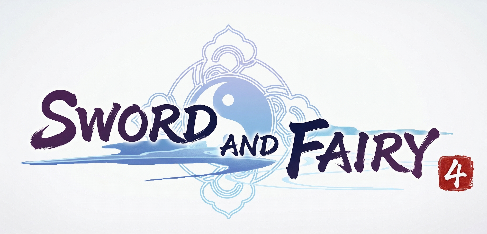
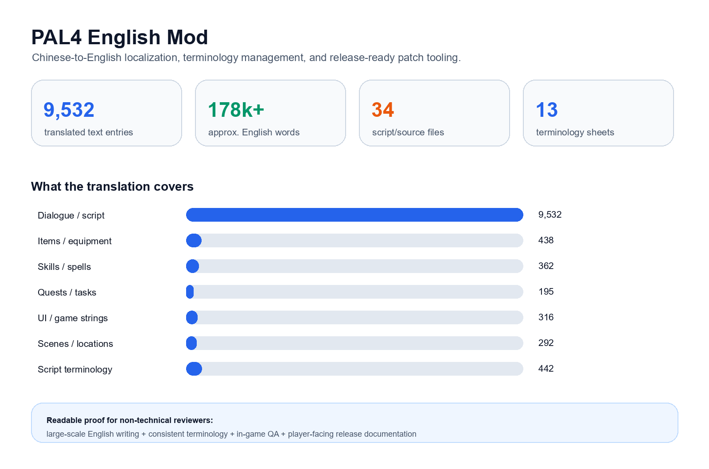

# PAL4 English Mod

  

An open-source fan localization and patching project for the Steam version of **Sword and Fairy 4 / Chinese Paladin 4**.

This project provides an English translation patch, structured terminology files, and Python-based installer tools that make the patch easier for non-technical players to install, update, and remove safely.

> This is a non-commercial fan project. It is not affiliated with, endorsed by, or sponsored by the original game developers, publishers, or rights holders. It is developed for the Steam version of Sword and Fairy 4 only.

## Current Version

**PAL4 English Mod v1.1**

Download the latest release from:

https://github.com/DodgeHo/PAL4_EnglishMod/releases

## Installation

There are two supported installation methods.

### Option A: Downloader Installer

Recommended for most players.

1. Download `PAL4_EnglishMod_Installer_1.1a.exe` from the Releases page.
2. Run the installer.
3. The installer will try to detect your Steam game folder automatically.
4. It will download and install the patch files.

Notes:

- The installer package is small, around 16 MB.
- An internet connection is required during installation.
- The patch download is around 1.3 GB.

### Option B: Manual Patch Zip

Use this option if you prefer to install the patch manually.

1. Download `PAL4.EnglishMod.Patch.1.1a.zip` from the Releases page.
2. Extract the zip file.
3. You should see a `1.1a/` folder.
4. Copy all files inside `1.1a/` into your game folder.
5. When Windows asks, choose **Replace files in destination**.

## How to Find the Steam Game Folder

1. Open Steam Library.
2. Right-click **Sword and Fairy 4** / **Chinese Paladin 4**.
3. Click **Properties**.
4. Click **Installed Files**.
5. Click **Browse**.
6. The opened folder is your game folder.

## Uninstall

Use Steam's file verification feature:

1. Open Steam Library.
2. Right-click the game.
3. Click **Properties**.
4. Click **Installed Files**.
5. Click **Verify integrity of game files**.

Steam will restore the original game files automatically.

## Localization Showcase

This project includes a visual localization showcase for readers who want to understand the effort behind the English patch: translation scale, before/after samples, terminology consistency, workflow, and release packaging.

  

Open the full visual page here after GitHub Pages is enabled:

**[PAL4 English Mod - Visual Localization Showcase](https://dodgeho.github.io/PAL4_EnglishMod/)**

Source page: [`showcase/index.html`](showcase/index.html)

The showcase can also be deployed through GitHub Pages using the included workflow. Metrics are generated from `assets/pal4_visible_export.translated.csv` and the terminology workbook in `assets/`. The approximate English word count is intended to communicate project scale, not literary word-count precision.

## What I Built

This repository is both a localization project and a small software delivery project. The work includes:

- English localization for visible in-game text.
- Structured translation terminology and glossary files.
- A Python downloader installer.
- A Python Tkinter GUI installer.
- Steam installation path detection.
- Patch download and extraction workflow.
- Mandatory file backup before patching.
- Manifest-based tracking for patched files.
- Reversible uninstall support through original-file restoration or Steam verification.
- Versioned release packaging for non-technical users.

## Translation Workflow

The translation work is organized around structured CSV files rather than loose text edits. This makes terminology review, consistency checks, and future updates easier.

The main translation assets are stored in [`translation_terms/`](translation_terms/):

| File | Purpose |
| --- | --- |
| `pal4_visible_export.translated.csv` | Complete Chinese-to-English translation table for visible in-game text |
| `Items.csv` | Item name translations |
| `gears.csv` | Equipment and gear name translations |
| `skills.csv` | Skill name translations |
| `spells.csv` | Spell and magic name translations |
| `tasks.csv` | Quest and task text translations |
| `scence.csv` | Scene and location name translations |
| `term_whitelist.csv` | Approved terminology whitelist for consistency checks |

The workflow focuses on:

- Maintaining consistent names for characters, locations, items, spells, skills, and quests.
- Separating terminology review from installer code.
- Keeping translated assets inspectable in plain text.
- Supporting repeated QA passes after in-game testing.
- Making future corrections easier to review and release.

## Engineering Notes

The installer tools are written in Python and are designed for Windows players who may not be familiar with mod installation.

Key implementation concerns:

- **Safety first:** original files are backed up before patching.
- **Path handling:** the installer attempts to locate the Steam installation path automatically.
- **Recoverability:** patch state is tracked so users can recover from failed or partial installation.
- **Release usability:** the project provides both a small downloader installer and a larger manual patch package.
- **Non-technical UX:** the GUI installer reduces the need for command-line usage.

Important files:

| File | Purpose |
| --- | --- |
| `pal4_english_mod_installer.py` | Main downloader/installer implementation |
| `pal4_english_mod_gui.py` | Tkinter GUI wrapper |
| `PAL4_EnglishMod_Installer.spec` | PyInstaller build specification |
| `PAL4_EnglishMod_Installer_GUI.spec` | PyInstaller GUI build specification |
| `translation_terms/` | Translation glossary and structured text assets |

## For Engineering Reviewers

This project demonstrates:

- Python desktop utility development.
- Localization engineering and structured terminology management.
- File patching workflow design with backup and recovery concerns.
- Release packaging for Windows users.
- Documentation for both technical and non-technical audiences.
- Long-form English translation and consistency maintenance.

It is intentionally small in infrastructure scope, but it reflects the kind of careful product work that matters in real user-facing tools: safe installation, clear recovery paths, documented releases, and maintainable source assets.

## Limitations

- Steam version only.
- Windows-focused installer workflow.
- Fan localization project; no commercial affiliation.
- Some visual or line-wrapping edge cases may depend on the original game UI.
- Translation updates may continue after v1.1 as players report issues.

## Support / Updates

I am DodgeHo, a long-time fan of the series.

- GitHub: https://github.com/DodgeHo/PAL4_EnglishMod
- Email: asdsay@foxmail.com
- Discord: daoanlandodge
- QQ Group: 1064586214
